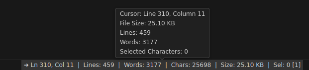

<!-- @format -->

# **VS Code File Stats**

A Visual Studio Code extension that displays file statistics in the status bar.

## **Features**

-   Displays the number of lines, words, and characters
-   Displays the number of selected characters and the number of selections
-   Displays the file size in a human-readable format (e.g., KB, MB, GB)
-   Toggle the visibility of the status bar item using the "Toggle File Stats" command
-   Jump to line in the active text editor by clicking on the status bar item or using the "Jump to Line" command

## Screenshots

## **Installation**

1.  Open the Extensions view in Visual Studio Code by clicking the Extensions icon in the left sidebar or pressing `Ctrl+Shift+X` (Windows/Linux) or `Cmd+Shift+X` (macOS).
2.  Search for "File Stats" in the Extensions view.
3.  Click the Install button to install the extension.
4.  Reload Visual Studio Code or wait for the extension to activate.

## **Usage**

1.  Open a file in Visual Studio Code.
2.  The file statistics will be displayed in the status bar.
3.  Select some text to see the number of selected characters and the number of selections.
4.  Use the "Toggle File Stats" command to toggle the visibility of the status bar item.

## **Commands**

-   `file-stats.toggle`: Toggle the visibility of the status bar item.
-   `file-stats.jumpToLine`: Jump to a line in the active text editor.

## Known Issues

-   No known issues

## Roadmap and Future Features

-   TODO: Add roadmap and future features

Read more from the [changelog](https://github.com/folarinmartins/vscode-file-stats/changelog.md).

## Contributing

Contributions are welcome! To contribute:

1. Fork the repository from [GitHub](https://github.com/folarinmartins/vscode-file-stats).
2. Create a new branch (`git checkout -b feature/your-feature-name`).
3. Make your changes.
4. Commit your changes (`git commit -m 'Add some feature'`).
5. Push to the branch (`git push origin feature/your-feature-name`).
6. Open a Pull Request.

Please ensure that your code adheres to the coding standards and includes appropriate tests.

## License

This project is licensed under the MIT License. See the [LICENSE](LICENSE) file for details.

I hope this sample README file helps! Let me know if you have any questions or need further assistance.
